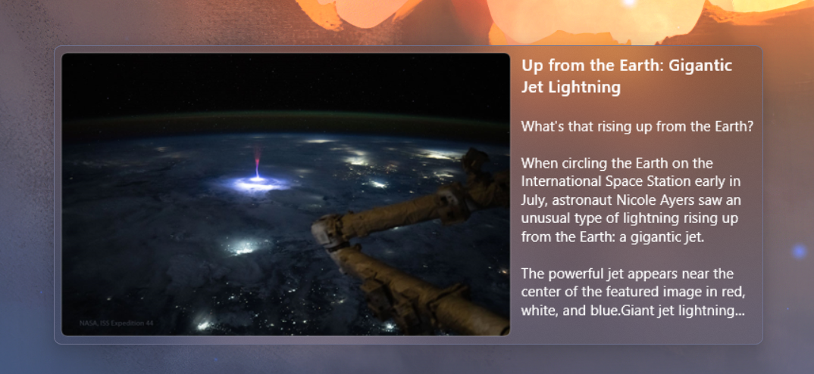
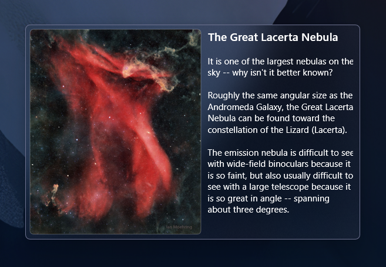

# Astronomy Picture of the Day for Rainmeter

<!--  --!>

This beautifully designed widget for [Rainmeter](https://www.rainmeter.net/) will show you Astronomy Picture of the Day from NASA right on your desktop. 

It is designed to perfectly fit Windows 11 esthetics, with rounded corners and blurred "frosted glass" background. Photos and description are loaded from [Astronomy Picture of the Day](https://apod.nasa.gov/apod/) by NASA.

Left click on the image will open it in a new window for further investigation, and left click on the description will open a web page with the full description. 

Bring a bit of cosmic wonder to your everyday life! ✨ 

## ❤️ Support
If you wish to support this project or say a little thanks, please see my [Ko-Fi](https://ko-fi.com/emvaized) and [Patreon](https://www.patreon.com/emvaized) pages 🙏
